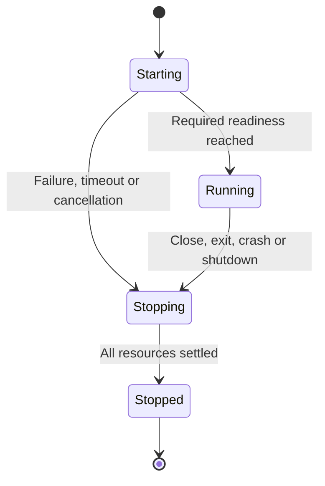

# WEFT OS — Stability Blueprint

**Target:** a usable, supportable `0.1.0` Linux desktop and application environment.  
**Baseline inspected:** WEFT `b99cc73a4704615521c38ca84dc46dc1bd641bc6` (`main`, 13 March 2026).  
**Contributor reference inspected:** Resina Design System `1e768064f57a1e403ab271822383e732795905a6` (`master`, 8 October 2026).  
**Prepared:** 8 October 2026.  
**Status:** source-verified development specification. The requirements below are the proposed completion contract; they are not a certification that the current implementation satisfies them.

## 1. Purpose and authority

WEFT is a Linux desktop in which Servo renders the system interface and application interfaces, Smithay manages Wayland presentation and input, Wasmtime executes application components, and `weft-appd` supervises their sessions. Applications combine a web interface with a separate Wasm component. A package manifest declares their identity, entries and requested host capabilities. This blueprint preserves that product model and completes its missing boundaries. [Existing architecture][architecture] [Workspace][workspace]

The intended user outcome is concrete: boot into the desktop, discover installed applications, launch and use them, switch and close them, preserve their data, install updates, and recover from a failed application without losing control of the desktop.

When this blueprint is adopted:

- `AGENTS.md` is the single engineering policy. It governs scope, validation, review, contribution and publication.
- This blueprint defines the accepted product direction, ownership, support scope and completion criteria.
- Versioned manifest, IPC, WIT and packaging specifications define public contracts. Existing compatibility promises must be inspected before changing them; this document does not silently erase them.
- Source and executed checks establish implemented behavior. Documentation and version labels cannot establish behavior independently.
- `.agents/` provides linked procedures and area knowledge. Reading a guide does not change the active task, grant authority, schedule maintenance or introduce a new approval requirement.

Reconcile any earlier local blueprint before implementation. Historical repository documentation referred to `docu_dev/WEFT-OS-COMPREHENSIVE-BLUEPRINT.md`, but its contents were not available in the inspected tracked tree. Do not claim to have incorporated unseen requirements. Preserve compatible decisions, identify material contradictions and prepare a concrete decision only where the accepted direction actually changes. [Historical baseline][historical-baseline]

This is durable product documentation and can be tracked in the repository when adopted. Temporary investigation notes, execution transcripts, review scratch files and progress reports are not product documentation.

## 2. Meaning of stable

### 2.1 Required release profile

Stable `0.1.0` means the complete supported path works on a named reference environment. It does not imply compatibility with every architecture, GPU, Linux distribution or checked-in backend.

| Profile | Status required for `0.1.0` | Scope |
|---|---|---|
| Linux `x86_64` nested session | Required | Real Smithay winit backend, both Servo hosts, Wasmtime, package tooling, session supervisor and reference applications |
| Bootable Linux `x86_64` reference VM | Required | Pinned Nix image, systemd session startup, graphical shell, real application execution, persistent storage, shutdown/reboot and recovery |
| Reference VM graphics | Required | One recorded QEMU/KVM configuration, virtual GPU, renderer path and host requirements; exercise DRM if the image uses it |
| Physical devices | Conditional | Support only devices and configurations present in the executed support matrix |
| Additional CPU architectures or host operating systems | Conditional | Utility compilation alone does not establish desktop support |
| EROFS/dm-verity packages | Conditional | May be supported only after the complete image, identity, privilege and failure-path contract in section 9 passes |

Choose the exact VM machine, graphics device, kernel/Mesa, CPU and memory settings during environment recovery and record them. QEMU with virtio-gpu is a candidate to evaluate, not a compatibility result established by this audit. A headless VM or successful Nix evaluation cannot satisfy graphical acceptance.

During environment recovery, boot a minimal instance of the intended reference VM and present a real compositor diagnostic surface. This checks the selected graphics/seat path early; full installed-product acceptance remains the later reference-image milestone. Continue independent nested fixes while arranging this target check.

The mandatory initial application model is one primary window per session, with explicitly supported dialogs and popups. Closing that primary application window terminates its session. Background execution needs a separate accepted contract and must not emerge from an unobserved runtime process.

Keyboard, mouse, wheel, app switching, resizing, focus and text editing are required. Validate declared US and Italian keyboard configurations. Touch, stylus, complex IME workflows, multi-monitor arrangements, native assistive-technology integration and advanced GPU APIs must not be advertised without corresponding complete fixtures. Features outside the supported profile must be visibly unavailable or clearly documented; they must not silently succeed.

### 2.2 Required user journeys

1. A fresh reference image boots into a usable system interface without terminal repairs or development checkout paths.
2. The launcher lists actual installed packages and exposes truthful launching, running, failed and stopped states.
3. Counter changes state through its real Wasm component and returns that state to its rendered interface.
4. Notes preserves exact text through save, close, reopen, daemon restart, package update and VM reboot.
5. Two applications run together, switch through keyboard and shell controls, receive correct input, and close independently.
6. A failed runtime, renderer, startup or package update produces an actionable error and converges to a recoverable state.
7. Undeclared host operations and forged session messages are denied at the host boundary.
8. A documented developer workflow builds, validates, installs, launches, diagnoses, updates and removes a real application package.

Counter and Notes are conformance applications. Passing their happy paths is necessary but insufficient: permission denial, malformed input, update interruption, process failure and graphical recovery are separate release gates.

## 3. Evidence and current baseline

### 3.1 What was verified

The audit inspected the tracked workspace, demos, manifests, WIT, dependency lockfile, graphics hosts, supervisor, package tools, service/Nix definitions and available CI metadata. The Resina contributor contract and complete `.agents/` tree were inspected at the reference revision above.

Additional bounded checks executed outside the Rust product build:

- The actual injected JavaScript bridge was exercised in Node with a mocked WebSocket; its messages were compared with the daemon's declared request/response shapes.
- The actual Notes frontend was exercised with a mocked DOM and controlled replies, reproducing stale-response replacement of newer edits.
- Both committed demo signatures were verified with Python's Ed25519 implementation against the canonical inventory algorithm in `weft-pack`: both were valid, covering nine files each.
- Temporary filesystem probes demonstrated the symlink behavior and package/data coupling relevant to the inspected path logic. These were source-directed probes, not execution of the Rust portal or installer.
- The current `systemd-run --user --scope --wait ... -- /usr/bin/true` argument combination was rejected with `--wait may not be combined with --scope`. No application service was launched by that check.

The execution environment did not contain Cargo, rustc or Nix. No full Rust compilation, real Servo window, running Wasm application session, DRM session or reference VM was executed during this audit. Those checks remain mandatory work. Passing observations below must not be broadened into unexecuted runtime claims.

### 3.2 Findings that determine the implementation order

| ID | Observed baseline | Consequence and required response |
|---|---|---|
| E01 | The selected Servo revision differs from `SERVO_PIN.md`; both embedders use APIs absent or changed in that revision. [Lockfile][lockfile] [Pin document][servo-pin] [App embedder][app-embedder] [Selected input API][servo-input] [Selected render API][servo-render] | Recover one reproducible dependency graph and compile both real embedding configurations before relying on graphics claims. |
| E02 | Both host frame paths omit `WebView.paint`; the EGL path has no actual presentation. [System embedder][system-embedder] [App embedder][app-embedder] [Servo rendering contract][servo-webview] | Implement paint and present, then verify pixels, wakeups, resize and idle recovery. |
| E03 | The workspace does not apply Servo's dependency-level Stylo patch; the selected upstream property remains gated. [Workspace][workspace] [Lockfile][lockfile] [Servo patch][servo-patch] [Stylo gate][stylo-gate] | Put necessary overrides at the workspace root and verify the selected graph and rendered feature. Parsing or a pin document is insufficient. |
| E04 | Without the runtime feature, `weft-runtime` prints readiness and exits; the feature-disabled app shell prints readiness and parks. The system shell instead reports its missing feature. Nix shell builds omit `servo-embed`. [Runtime][runtime] [App host][app-main] [System host][system-main] [Nix packages][nix-packages] | Separate limited build fixtures from product binaries. Ship and test actual engines; no synthetic success path may satisfy readiness. |
| E05 | The systemd launch path combines `--scope` and `--wait`. [Session implementation][appd-runtime] | Replace it with a valid, tested ownership mechanism that includes all session processes. |
| E06 | The UI bridge sends bare payloads, while the daemon expects tagged requests; replies are also differently wrapped. WebSocket clients enter the common dispatcher and receive common broadcasts without a session-specific authenticated binding. [Bridge][app-embedder] [Daemon messages][appd-ipc] [WebSocket server][appd-ws] | Define a single semantic protocol, separate system control from app messaging, and authorize each connection before repairing demo interaction. |
| E07 | Host imports are registered without applying effective per-session grants. Read-only and writable preopens converge to unrestricted directory/file permissions. The portal checks lexical prefixes before following paths. [Runtime][runtime] [Session preopens][appd-runtime] [Portal][file-portal] | Enforce capabilities at every host entry, preserve access modes and use filesystem confinement that survives symlinks and races. |
| E08 | Appd marks a session running before UI readiness; UI spawn/exit and several early failures do not share complete cleanup. IPC paths contain stale relay and lock/cancellation risks. [Session implementation][appd-runtime] [Daemon lifecycle][appd-main] | Give the session one owner, readiness contract and cleanup path; test every child failure and fragmented/cancelled transport. |
| E09 | Pending PID associations are not consumed; focus/destroy requests only log; toplevels start at the same position; custom geometry requests do not establish effective placement. [Compositor association][compositor-appd] [Compositor state][compositor-state] | Implement authenticated session/surface association and compositor-owned focus, geometry, stacking and destruction. |
| E10 | DRM submission lacks the completion transition, idle/empty-frame scheduling is incomplete, activation only logs, and the DMA-BUF global is not created. Layer rendering exists; layer input hit-testing is incomplete. [DRM backend][drm] [State][compositor-state] [Input][compositor-input] | Complete the selected backend's presentation, recovery and input contract; do not replace already existing layer rendering on a false premise. |
| E11 | Default app data lives under the installed package directory; installation rejects an existing package and removal deletes that tree. [Session data paths][appd-runtime] [Package operations][pack] | Separate user data before an update workflow. Never require uninstalling the old package to update it. |
| E12 | Signing covers the recursively enumerated inventory, including UI assets, while documentation describes only manifest plus Wasm. Installation does not establish trust by invoking signature verification. Both committed signatures are valid under the implemented inventory algorithm. [Package signing/install][pack] [Existing security documentation][security] | Preserve the working cryptographic behavior, define trust policy and enforce it transactionally. Correct the documentation; do not “repair” valid signatures by signing the wrong content. |
| E13 | Image builder and loader disagree on companion filenames; mount failure can fall back to a mutable directory; runtime, UI and capability resolution can use different roots. [Image builder][pack] [Mount loader][mount] [Session resolver][appd-runtime] | Resolve one verified package descriptor and make verified-mode failures fail closed. |
| E14 | Manifest entry paths lack complete confinement, Wasm checking is only a magic-prefix check, and runtime loading ignores the declared module entry. Installation writes directly into its final destination. [Package validation][pack] [Runtime entry][runtime] | Use shared manifest/entry validation, component validation and recoverable staging before activation. |
| E15 | Notes can overwrite newer editor content with a late reply and transforms literal backslash sequences. [Notes UI][notes-ui] [Notes component][notes-runtime] | Use structured serialization, revision-aware replies and atomic persistence with an explicit concurrent-writer policy. |
| E16 | Nix/session configuration omits required features/assets or launch configuration, guesses a Wayland display, and disables VM graphics. [Nix packages][nix-packages] [Nix configuration][nix-config] [Flake][flake] [Service units][services] | Produce and exercise one coherent installed image, with real assets, endpoints and activation. |

At the inspected HEAD, the available GitHub run metadata reported successful portable Ubuntu/Windows jobs and failed Linux-only/Servo jobs. The old detailed logs were unavailable; the audit does not assign a historical CI failure to a particular finding above. Re-run the exact relevant configurations to establish current results. [Recorded CI run][ci-run]

The manifest already declares `0.1.0`; the inspected checkout contained no tags and the release listing was empty. A manifest number is not release qualification. Inventory current remote refs and published artifacts again before assigning versions. [Workspace version][workspace] [Releases][releases]

### 3.3 Questions requiring execution, not assumptions

- Demo components and host WASI dependencies show different WIT patch versions (`0.2.6` and `0.2.3`); Wasmtime's linker has compatible-version behavior. A textual version difference alone does not establish an ABI defect. Instantiate actual components and exercise imports. [Wasmtime linker][wasmtime-linker]
- Validate the fetch response shape against an actual component. Do not report an ABI mismatch from a Rust tuple versus WIT record appearance alone.
- Clipboard and notifications call real external helpers; they are not logging stubs. Their services, permission enforcement and behavior still need integration evidence. [Runtime host functions][runtime]
- The mount helper contains a privileged execution path, but the inspected Nix image does not establish a functioning setuid deployment. Review and test privilege before enabling it; do not describe a hypothetical deployed privilege escalation as an observed VM exploit. [Mount helper][mount-helper] [Nix packages][nix-packages]
- No performance, battery, hardware compatibility or accessibility-service result was established by the audit.

## 4. Architecture and ownership

| Owner | Authoritative responsibility | Must not own implicitly |
|---|---|---|
| Linux and systemd | Seat/session substrate, service lifecycle and enforced process/resource boundaries | Product session identity inferred from arbitrary child output |
| `weft-compositor` | Surface ownership, geometry, focus, stacking, work areas, input routing and presentation | Application data, package trust or unvalidated shell privilege |
| `weft-servo-shell` | System chrome, launcher, navigation and user-visible session controls | A second authoritative copy of app/session lifecycle |
| `weft-appd` | Resolved package selection, grants, session identity, child supervision, readiness and cleanup | Unbounded global application broadcasts or frontend-supplied authority |
| `weft-runtime` | Component instantiation, WIT host calls and enforced WASI resource access | Package selection independent of appd or unrestricted ambient imports |
| `weft-app-shell` | One application's document, rendering and narrow session bridge | System-control credentials, another app's data or privileged shell roles |
| Package tooling/store | Manifest validation, content identity, trust, staging, activation and retention | User data lifecycle coupled to installed bytes |
| Portals/host services | Operations on explicitly granted resources | A second, weaker permission model |

Keep the UI and Wasm runtime in separate processes. Share code where behavior is actually common, without merging their privileges or failure domains. Do not replace the compositor or browser engine as a shortcut around finishing their contracts.

### 4.1 One resolved package descriptor

Before spawning children, appd must resolve and validate one immutable launch descriptor:

| Field | Required meaning |
|---|---|
| Package identity | Validated application ID, package version and immutable content identity |
| Package root | Exact validated root of that selected revision |
| Runtime entry | Contained, validated `[runtime].module` |
| UI entry | Contained, validated `[ui].entry` from the same revision |
| Effective grants | Manifest requests intersected with explicit host/user policy |
| Data root | Persistent application storage independent of package bytes |
| Session identity | Opaque session ID plus generation/epoch sufficient to reject stale references |
| Owned resources | Supervisor-controlled handles/endpoints required by the chosen launch path |

Runtime, app shell, portals and compositor registration must derive from this descriptor. Do not independently rediscover package roots, parse a different manifest or infer identity from a title/PID. An active session remains pinned to its selected revision across package updates.

Implement one manifest parser and resolution contract at the narrow shared boundary where required. A new shared crate is justified only when it removes actual duplication; the crate structure itself is not a release goal.

### 4.2 Manifest and component compatibility

Specify schema version, identifier rules, required entries, supported capability syntax and unknown-field/version behavior. Preserve existing manifest compatibility deliberately or provide a tested conversion/error path. Validate entry containment, file kinds, link policy and package identity before execution.

Validate an actual WebAssembly component and the required world/imports/exports using the selected toolchain; four magic bytes do not establish compatibility. Maintain one canonical WIT source and generated bindings or a checked synchronization mechanism. Each supported host import needs an actual component fixture proving its ABI, allowed behavior, denial and error handling.

## 5. Security and capability contract

### 5.1 Threat model

Treat both packaged web content and the Wasm component as untrusted application code. They must not read another app's data, obtain undeclared host operations, issue system lifecycle commands, impersonate another session or assign themselves privileged surface roles.

Treat the compositor, supervisor, installed package resolver, host policy and trusted system shell as the control boundary. Bootstrap authority must come from a trusted channel and observed peer identity, not from application-provided metadata.

The initial product does not promise protection from an arbitrary hostile native process already running as the same host user or an administrator who modifies the installation. State that scope explicitly. It does not excuse unsafe privileged helpers, application-facing host APIs or package code escaping the declared resource boundary. Do not claim that separate processes or a syscall blocklist alone provide complete confinement.

The renderer must obey the same declared authority as its component. Define policy for package resources, external navigation, downloads, local file URLs, network requests and subprocess/service access. Enforcement must exist at the engine or operating-system boundary; frontend JavaScript checks are insufficient. If the selected Servo build cannot enforce a required boundary, complete an effective containment mechanism or narrow the supported content policy through an explicit product decision before release. Do not advertise a sandbox that has only been implemented on the Wasm side.

### 5.2 Effective grants

The default is no application access beyond the documented minimal execution resources. The supervisor derives effective grants once, and each host operation checks them. Unknown or unsupported capability requests fail clearly. Installing a signature-valid package does not automatically approve all its permissions.

| Resource | Required behavior |
|---|---|
| Package content | Read-only access to the selected revision; no package path outside it |
| Private app data | App-specific root; read and read/write remain distinct |
| User-selected directories | Actual platform directory resolution and explicit grant; no guessed home subdirectory treated as authority |
| File portal | Same mode/path policy as WASI; operations confined against traversal, symlinks and races |
| Fetch | Explicit supported schemes, destinations/ports, methods and budgets; authorize redirect destinations and define credential forwarding |
| Clipboard | Separate read/write grants, usable platform service, bounded payloads and meaningful errors |
| Notifications | Individual grant, actual delivery path, bounded content and actionable failure |

Filesystem confinement must use descriptor-relative or equivalent kernel-supported operations that enforce the policy during the operation. `canonicalize()` followed by reopening an attacker-controlled path is not sufficient against replacement races. Cover intermediate and final symlinks, `..`, nonexistent write targets and links changed during access. Apply the same constraints to installation, extraction and manifest entry resolution.

Fetch must have explicit connect/overall deadlines, request and response limits, and cancellation behavior. Handle each redirected destination under the grant. Keep HTTP error statuses distinct from transport errors. If domain grants are supported, specify normalization, subdomain matching, ports and the treatment of resolved local/private destinations rather than leaving those decisions to the HTTP library.

No host import, including a convenience helper, may bypass the effective policy. Every compiled and advertised import belongs in the conformance matrix; absent support must not be represented as a successful no-op.

### 5.3 Resource and privilege limits

Apply session ownership and resource limits to the runtime, renderer and helpers together. Bound memory, active processes, queued messages/bytes, in-flight requests, logs, host response sizes and operation lifetimes. Use finite configurable defaults and measure them on the reference target; freeze release budgets before beta. Do not invent measured performance claims.

Before enabling a privileged helper, specify its caller authorization, allowable package identifiers, trusted store roots, output locations, command paths and environment. Use exact executable paths and argument arrays. Reject arbitrary caller-controlled mount sources/destinations. Apply appropriate read-only, `nodev` and `nosuid` policies and prove cleanup after every failure. Privilege must not be enabled merely to bypass a failing development configuration.

## 6. IPC and session lifecycle

### 6.1 Role-separated protocol

System control and application messaging must have separate authority, even if a transport implementation is shared.

| Connection | Authority |
|---|---|
| Trusted system shell/administrative client | Authorized catalog, lifecycle and window operations |
| Application bridge/runtime | Only the operations and private messages of its own authenticated session |
| Diagnostic client | Only the explicitly granted diagnostic/control subset |

Bind role, session and generation on the server. A caller-provided `session_id` is a routing claim, not authentication. Never deliver private payloads to unrelated subscribers. Do not expose a system-control secret inside application content.

Use private local endpoints with appropriate ownership and permissions. A browser-facing WebSocket requires an authenticated session bootstrap with expiry, replay handling and termination behavior. Loopback binding and Origin validation are additional controls; neither substitutes for authorization. Keep credentials out of logs and unintended URLs/referrers, and ensure a reconnect cannot acquire a different session.

Define a versioned semantic envelope with message kind, request correlation, payload, result/error and session generation as appropriate. Native framing and browser serialization may differ, but the bridge and daemon must share these meanings. Publish real request/response examples from the tested contract. App content should use a small bridge API, without rebuilding daemon envelopes or receiving administration messages.

Bound frame size, queued message count, queued bytes and per-connection concurrency. Preserve partial frames across cancellation. Do not hold the session registry lock while awaiting socket/channel work or reacquire it through an error branch. Closed relays must be removed. Detect overflow or missed events and resynchronize from an authoritative snapshot; do not continue with silently stale state. Tokio specifically documents cancellation concerns for `read_line`; choose a framing primitive or buffered decoder with the required behavior. [Tokio I/O contract][tokio-lines]

### 6.2 Single lifecycle owner

Use one session model, with structured terminal reasons:

`Running` means the component is initialized, session IPC is connected, the application document and bridge are initialized, and the associated surface has reached the defined first-frame presentation condition. A minimized or temporarily occluded session can remain running; initial readiness and ongoing visibility are different facts.

Readiness must use trusted host signaling. The component's `notify.ready` is one input to the host lifecycle, not authority to bypass UI readiness. Arbitrary stdout text cannot establish readiness. Drain stdout/stderr from process creation onward, independently of lifecycle signals.

Authenticated session bootstrap and the narrowly defined initialization exchange must be permitted while `Starting`. Specify which messages are legal in each lifecycle state. Do not require `Running` to complete an exchange that is itself necessary for readiness. Bound startup traffic and apply the same grants, session binding and cleanup rules as during normal execution.

A user close request must allow the application's declared unsaved-change policy to complete before primary-surface destruction and session teardown. Define cancellation and a bounded response timeout. Once close is accepted, settle the entire session. Explicit force termination, crashes and system-session shutdown have separate documented policies and must not be reported as a successful save. This interaction precedes `Running -> Stopping`; it does not require another independent lifecycle model.

A session owns both children, portal/helper processes, relays, sockets, compositor associations, temporary directories and optional mounts. Every exit path enters the same cleanup mechanism: spawn failure, malformed package, initialization failure, timeout, cancellation, guest trap, child crash, explicit close and daemon shutdown. Do not let renderer failure leave an apparently running invisible application.

Use a valid process-group or systemd mechanism that preserves that ownership. Attempt graceful termination for a bounded interval, then terminate remaining owned processes and await settlement. Do not sleep for an arbitrary duration and assume cleanup finished. Test direct and systemd paths only if both are supported; otherwise remove the unsupported path from product promises.

On daemon failure, use durable/OS-backed ownership to reconcile or terminate owned stale sessions. Do not infer ownership from a recycled PID, a matching directory prefix or an untrusted client claim. The initial policy may restart applications explicitly after cleanup; it does not promise restoration of arbitrary in-memory application state. Prevent restart loops and retain useful terminal reasons.

## 7. Rendering, windowing and input

### 7.1 Servo host contract

Recover the exact selected API first. Implement frame notification, repaint scheduling, `WebView.paint`, backend presentation and meaningful error handling. Event-loop progress alone is not a rendered frame. Readback must follow painting, and EGL requires a real present operation. [Selected Servo contract][servo-webview] [Rendering context][servo-render]

Handle zero-size/minimized windows, resize, output scale, logical/physical coordinates, graphics context lifetime, first frame, waking from idle and shutdown. Keep reusable rendering resources alive where required. Do not hide missing wakeups with continuous unbounded repainting.

Use a deterministic page with known color regions, text, scrolling content, a text field, an interactive counter and controlled animation. Check actual pixels and input results on the supported path. For transparency/backdrop effects, verify the selected dependency graph and rendered behavior; unsupported effects need an honest usable fallback in the UI.

After one working path exists, extract demonstrated common host/render/input behavior from the two embedders. Preserve the distinction between trusted system chrome and an untrusted application document. Do not build a generic engine abstraction without a present requirement.

### 7.2 Surface and window contract

The compositor owns accepted geometry, stacking, focus and work areas. Appd owns session identity. The shell issues requests and renders the resulting state. Bind surfaces through trusted launch/connection evidence and observed client identity, with opaque window/session IDs and generations. PID alone is not durable authority.

Support creation, activation, move/resize under the selected window policy, maximize/restore, close, child dialogs/popups and destruction. Effective Wayland geometry and acknowledged state must agree. Define one coherent relationship with xdg configure/acknowledgement; an echoed custom geometry request does not move a surface.

Establish painting and hit-testing order for background, application work area, panel/navigation, overlays and popups. Define input regions, reserved work areas, parentage, dismissal and focus restoration. Only the trusted shell can acquire privileged roles. A normal opaque toplevel labelled `panel` cannot substitute for that behavior.

A multi-surface shell hosted by one trusted Servo process is a reasonable implementation. A single-document implementation is also acceptable if it proves correct clipping, transparency, ordering and input regions. Choose once based on the selected APIs and a working fixture; keep product ownership unchanged.

### 7.3 Required input and accessibility behavior

Forward key press/release, modifiers, mouse buttons, motion, enter/leave, wheel, focus changes and scale changes correctly. Preserve physical/logical coordinate consistency. Prevent stuck keys/buttons after focus loss, client exit, drag cancellation or output changes. Verify declared keyboard layouts and non-ASCII editing through the real native path.

The system UI requires semantic controls, accessible names, logical keyboard order, visible focus, no keyboard traps, Escape/dismiss behavior and focus return for overlays. Verify theme contrast and reduced-motion behavior. Native screen-reader/AT-SPI support requires an actual accessibility inspector and assistive-technology test with the selected engine; a dependency name or DOM attribute does not establish platform integration.

### 7.4 Backend-specific completion

For the nested backend, verify real surfaces, resizing, input, focus, idle wakeups and application failure recovery. For every release path using DRM, additionally implement and test:

- Completion of queued frames, including the required `frame_submitted()` transition.
- Synchronization and presentation feedback tied to successful presentation.
- Empty-frame and idle scheduling that resumes on input/content commits.
- Render/submission error recovery.
- Session pause and activation.
- The declared output add/remove and mode-change behavior.
- Cursor and DMA-BUF mechanisms actually advertised to clients.

Use the selected Smithay contracts; unsupported globals must not be advertised. [Smithay output contract][smithay-output] [DMA-BUF global contract][smithay-dmabuf]

## 8. System interface and application behavior

The launcher must derive its catalog from validated installed packages. Treat manifest names, descriptions, icons and other metadata as untrusted input; avoid unsafe HTML injection. Use one authoritative endpoint configuration and bridge rather than a second hardcoded WebSocket connection in the page.

Provide launch, activate/switch and close actions, including keyboard access to system navigation. The taskbar must activate applications as well as terminate them. Loading and failure states must correspond to authoritative lifecycle state and explain what the user can do next. Reconnecting the shell must restore a coherent snapshot without duplicate or stale applications.

Show only supported settings and controls. Theme or visual refinement must preserve readable text, focus, error states and performance. Shutdown/reboot must use the supported image's authorized host path. Do not put implementation details, development roles or internal status claims in product UI.

### 8.1 Counter

Counter is the smallest complete proof of application execution. A user action must reach the real component; the component's reply must drive the rendered value. Local JavaScript state cannot stand in for the component. Closing Counter must settle its runtime, renderer, relays and compositor state.

### 8.2 Notes

Notes is the reference for persistent user data. Use a real serialization implementation and preserve Unicode, whitespace, actual newlines and literal backslash sequences exactly. No ad hoc replacement of `\\n` with newline or string concatenation for structured JSON.

Associate load/save replies with the operation and editor revision that produced them. A late response must never overwrite edits made after that operation began. Define an explicit concurrent-writer policy, such as revision-checked writes with a visible conflict, and test it. Do not silently accept lost updates.

Persist through a temporary file and recoverable atomic replacement, with durability semantics appropriate to the filesystem and the acknowledgement promised to the UI. Keep the previous saved copy when writing fails. Acknowledge a save only after the specified persistence operation succeeds. Show unsaved changes and actionable failures; closing must follow a defined unsaved-change policy.

The reference fixture must cover empty text, non-ASCII text, multiple lines, quotes, literal backslashes, delayed load/save responses, a failed write, repeated saves and competing writers. Repeat persistence checks after reinstall/update, app and daemon restart, and VM reboot.

## 9. Packages, trust, storage and updates

### 9.1 Independent storage lifecycles

Use distinct locations and ownership for immutable package revisions, persistent application data, disposable cache and session runtime resources. Resolve platform directories from the supported environment. Do not place writable data beneath content that is signed, removed or replaced during package operations.

A suitable logical layout is:

| Store | Lifecycle |
|---|---|
| Package revisions, keyed by app ID and content identity | Immutable after activation; retained while referenced by sessions or rollback policy |
| App data, keyed by app ID | Persists independently across package updates and ordinary uninstall |
| App cache | Reconstructible; cleanup must not remove user data |
| Session runtime resources | Private, ephemeral and settled by the session owner |

Choose actual XDG/system paths once and use the common resolver. Preserve overrides only where their behavior and authority are explicit. Migrating the existing `apps/<id>/data` layout requires detection, backup/recovery behavior, conflict handling and a test proving existing Notes contents survive. Do not hide data migration inside an unrelated cleanup.

### 9.2 Package identity and trust

Specify canonical inventory ordering, path representation, supported file types, normalization and signature algorithm. The current implementation signs a hash of the recursively enumerated inventory, including UI content and excluding the signature file; the supplied demos verify under that algorithm. Preserve compatibility deliberately when formalizing the format. [Canonical implementation][pack]

Validate IDs, entry paths, duplicates, link policy and package structure before trust decisions. For the initial format, rejecting package symlinks is a reasonable simplification; if links are supported, define and enforce their integrity and confinement consistently across archives, signing, copying and runtime access. No format may verify one set of bytes and then execute different bytes after a race or mutable replacement.

Define two explicit operating policies:

- **Verified installation:** trust is established against an authorized key/store policy; invalid, missing, revoked or untrusted signatures fail closed. Verification must cover all executed and rendered package content.
- **Development installation:** unsigned/local content is allowed only through an explicit developer choice and visibly identified as such. It must not silently replace or masquerade as a verified revision.

The distributed reference image uses verified packages for its shipped applications. Demo keys are fixtures and must never become production signing authority. Keep release private keys outside the repository. Document how trusted keys are added, removed and rotated, and how installed/running revisions respond to revocation. A networked key service or general PKI is unnecessary unless a concrete distribution requirement justifies it.

Bind each installed application ID and its retained data to an authorized publisher/update-key policy. A generally trusted key must not be able to replace an unrelated publisher's application merely by reusing its ID. Preserve that ownership record across ordinary uninstall while data remains. Key rotation or ownership transfer requires the established authorization and an explicit transition. Refuse developer-install collisions with a verified identity, or use a separate development identity and data namespace. A new package requesting additional grants must follow the explicit grant policy; prior approval does not silently expand with an update.

Signed bytes establish origin/integrity under a trust policy, not safety or unrestricted permissions. Grant approval and signature verification remain separate decisions.

### 9.3 Transactional installation and update

The supported package workflow must:

1. Stage a complete candidate revision in a controlled location on the target filesystem.
2. Validate its structure, manifest, component and entries.
3. Verify its canonical content and trust under the selected installation policy.
4. Establish immutable, correctly owned installed content.
5. Activate the revision through a recoverable atomic transition.
6. Retain the previous revision while active sessions or rollback retention require it.
7. Clean unreferenced staging/revisions through a defined recovery policy.

A failed validation, full disk, denied write, crash or interruption must preserve the previous active revision when one exists; a failed first installation must leave the package uninstalled without phantom activation. User data remains intact in either case. A live session remains pinned to its original package bytes. Uninstall removes availability for new launches and follows an explicit policy for live sessions; it preserves user data by default. Purging data is a separate, explicit destructive action.

Package rollback and data rollback are different operations. If an application changes its data schema, define compatibility and recovery for that actual migration before shipping it. Do not invent a generic migration framework or imply that switching package revisions reverses user data automatically.

### 9.4 Verified images

If EROFS/dm-verity is part of a supported release profile, the builder and loader must share artifact names, version identity and metadata. Authenticate the image identity, root hash and necessary companion data under the package trust model. Verify that runtime, UI, manifest and grants refer to the same mounted revision.

A mount or verification failure in verified mode must not select an unverified mutable directory. Privileged operations must satisfy section 5.3. Test invalid image/hash pairs, tampered metadata, missing tools, caller authorization, partial mount failure, process termination and cleanup. Until these gates pass, keep this mode out of the supported image and document that limitation accurately.

Verified directory packages can satisfy the initial package profile only when their installed content cannot be modified by application code and the trust/identity checks remain effective through launch. Merely marking a same-user directory read-only by convention is insufficient.

## 10. Build, deployment and dependency policy

### 10.1 One reproducible product build

Record the actual Rust toolchain, target, workspace feature set, lockfiles, Servo/Stylo revisions, native libraries and build commands. Build both Servo hosts with their real renderer feature and the runtime with its real Wasmtime feature. Keep feature-disabled paths clearly confined to limited tooling checks; they cannot be distributed as functioning product components.

The selected dependency graph is authoritative for APIs. The inspected Cargo lockfile selects Servo `8e7dc40bff42448980b7249798f17e3131547138` and Stylo `dca3934667dae76c49bb579b268c5eb142d09c6a`; these are recovery evidence, not a direction to preserve old revisions indefinitely. Confirm whether the selected compatible stack should be repaired or updated in a bounded dependency change. [Lockfile][lockfile]

Apply required Cargo overrides at the consuming workspace root; dependency-level patch tables do not apply transitively. Inspect the resolved graph and verify each claimed fix on the actual selected code. Keep a short purpose, upstream status and removal condition for retained fork patches. [Cargo patch rules][cargo-patch]

Never fabricate `pkg-config` metadata, native library versions or readiness messages to pass a build. Repair the supported environment or clearly exclude an unsupported feature. Do not copy machine-specific usernames or checkout paths into the documented workflow.

Dependency updates need scope, compatibility evidence, relevant security review and the same per-step review as product code. Before beta, check the actual chosen versions against current upstream fixes/advisories and release support requirements. Record the assessment rather than assuming either that the latest tip is suitable or that an old pin is safe.

### 10.2 Installed session

Choose one authoritative Nix/systemd configuration and make supporting development units/scripts consistent with it. The installed closure must include:

- Correct feature-enabled binaries and runtime native dependencies.
- Shell HTML and required UI assets at real installed paths.
- Reference application packages with an explicit trust configuration.
- The actual app-shell and runtime paths, and paths for enabled portals/helpers, passed to appd.
- Explicit service activation/dependencies and truthful readiness.
- The real compositor display and daemon endpoints, without guessed names such as `wayland-1`.
- A seat/session arrangement that works in the reference VM.
- Separate persistent data and ephemeral runtime storage.
- Bounded restart behavior, diagnostics and authorized shutdown/reboot.

Build and boot the complete graphical closure from a clean environment. Verify updates/rebuilds preserve persistent data. No checkout-relative assets, manual environment repair or silently disabled product checks may be necessary for the documented release path.

### 10.3 Diagnostics and developer workflow

Document one supported path from checkout to real system and one installed-package workflow: build, check, verify, install, inspect, launch, status, terminate, update and uninstall. Existing commands plus a small diagnostic harness are sufficient; a new general CLI framework is not a goal.

Emit structured error categories for invalid packages, denied grants, startup timeouts, child exits, transport failures and rendering failures. Correlate diagnostics with safe session identifiers. Default logs must not dump application payloads, clipboard contents, saved notes or credentials. Preserve useful terminal reasons without indefinite log growth.

## 11. Verification contract

### 11.1 Evidence levels

| Level | What it can establish | What it cannot establish alone |
|---|---|---|
| Source inspection | Ownership, missing paths, API use and policy inconsistencies | Successful execution |
| Unit or pure contract test | Deterministic parser, state, serialization or boundary behavior | Full child-process, graphics or platform integration |
| Actual component/protocol integration | ABI, message semantics, grants and exercised lifecycle paths | Installed desktop behavior unless it runs that path |
| Graphical nested execution | Presented pixels, native input and desktop interactions on that backend | Reference-image boot or unrelated DRM behavior |
| Booted image and target-specific tests | Installed closure, session startup and behavior on the named target | Compatibility with untested devices |
| Failure and soak qualification | Defined recovery/reliability behavior within measured conditions | Absence of every possible defect |

Record commit, environment, selected features, command/harness, result and useful diagnostics. A missing environment or skipped required test is an incomplete gate, not a pass. Distinguish tests executed from tests only designed. Fixtures must fail when the promised behavior is broken; avoid tests that restate the implementation or only inspect a success log.

### 11.2 Verification profiles

Create profiles from commands that actually exist in the recovered repository. Names below describe responsibilities; they are not a claim that corresponding commands are currently installed.

| Profile | Required coverage |
|---|---|
| Contributor documentation | Policy consistency, Markdown links/catalog/metadata, runner behavior and actual diff review |
| Portable Rust/tooling | Relevant format/lint/tests for supported portable crates; no desktop-support inference |
| Linux product build | Correct runtime and Servo features, native dependencies, locked graph and required Linux crates |
| Component and protocol | Actual Wasm fixtures, canonical WIT, authenticated bridge, framing, limits and denied operations |
| Nested desktop | Real shell/app pixels, Counter, Notes, input, geometry, switching, lifecycle and reconnection |
| Package and data | Trust, confinement, atomic activation, interruption, retained data and live revision pinning |
| Reference image | Build, graphical boot, installed assets/endpoints, persistence, shutdown and service recovery |
| DRM or optional feature | Feature-specific positive, negative and recovery scenarios on the declared target |
| Release qualification | Full supported matrix, regression/failure suite, reliability runs, exact artifacts and independent review |

Demos are excluded from the current root workspace; their builds and actual component fixtures must be included explicitly where relevant. Default `cargo test --workspace` cannot prove their execution or the feature-enabled product behavior. [Workspace exclusions][workspace]

Use the smallest sufficient validation set for each change. Expand testing for a concrete affected boundary, regression risk or release gate. Do not repeatedly run unrelated expensive suites after the remaining risk is resolved. Conversely, do not weaken required checks or regenerate expectations merely to make a failing result green.

### 11.3 Required acceptance fixtures

| Fixture | Observable acceptance |
|---|---|
| Real first frame | Both hosts paint and present known content; no fake readiness or permanently blank surface |
| Initialization exchange | A UI that needs an initial component response completes its authenticated bootstrap while Starting and reaches truthful readiness |
| Counter | UI action reaches the actual component and its returned value updates the DOM |
| Notes exactness | Unicode, newlines, quotes and literal backslashes round-trip exactly |
| Notes ordering | Delayed load/save replies cannot replace newer edits; concurrent writes follow the declared policy |
| Notes close policy | Save/discard/cancel behavior follows the declared policy before teardown; forced termination never claims a successful save |
| Notes durability | Failed write preserves prior content; close/reopen, reboot and package update preserve successful saves |
| Two sessions | Switch and close independently; focus, stacking and payload delivery match ownership |
| Unauthorized client | Forged/mismatched/stale credentials cannot call system operations or access another session |
| Capability denial | Every advertised host import has allowed, denied and failure-path component tests |
| Filesystem confinement | Read-only writes, parent traversal, intermediate/final symlinks and replacement races are rejected |
| Entry validation | Escaping paths, wrong component world, missing entries and invalid identities fail before launch |
| Startup failures | Missing binaries, renderer failure, invalid package and readiness timeout produce a terminal reason and complete cleanup |
| Cancellation/crash | Runtime/UI death and cancellation at each startup phase leave no owned processes, relays, sockets or mounts |
| Framing/backpressure | Fragmentation, cancellation, concurrent traffic, full queues and closed relays do not corrupt frames or deadlock appd |
| Reconnection | Daemon/shell restart follows ownership policy and restores a coherent catalog/session snapshot |
| Geometry/input | Move/resize/maximize, focus, wheel, declared layouts and scale changes work without stuck input or coordinate drift |
| Idle/redraw | Input/content changes resume rendering after idle; no unbounded repaint loop is required |
| Package integrity | Tampering with executable, manifest or UI content fails verified installation/launch |
| Publisher ownership | A different trusted key cannot take over an app ID or retained data, including after uninstall; developer collisions are isolated/refused; authorized key rotation preserves ownership |
| First-install interruption | Failure leaves the package uninstalled, data intact and staging recoverable/removable; partial content is never active |
| Update interruption | Failure preserves the previously active revision, intact user data and recoverable staging |
| Active update | Existing session retains its package revision while a new launch resolves the new revision |
| Uninstall/migration | User data survives ordinary removal and legacy-layout migration; purge is explicit |
| Host services | Supported fetch/notification/clipboard behavior works in the installed environment and respects grants |
| Reference boot | Fresh graphical image starts the complete system without checkout paths or manual fixes |
| DRM recovery | Supported session deactivate/reactivate and output changes resume presentation correctly |
| Optional image mode | Tamper, mount failure and interrupted cleanup never downgrade verified execution |

For reliability qualification, adopt these initial acceptance targets and freeze any justified adjustments before beta:

- 20 consecutive clean reference-VM boots without failed session bring-up.
- 100 application launch/activate/close cycles without orphan processes or stale sessions.
- A two-hour mixed interactive run plus a separate idle/resume test.
- No uncaught host crash, deadlock, lost acknowledged data, cross-session disclosure or unbounded process/queue growth in those runs.

These are proposed acceptance targets, not measured baseline results. Measure launch time, input responsiveness, idle CPU, memory and log/queue growth on the reference target. Select and document acceptable budgets before beta; release candidates must meet the frozen budgets or present a reviewed scope decision before promotion.

## 12. Development sequence

Use dependency order and complete observable results. Do not begin with a repository-wide rewrite or treat security/data preservation as a late hardening stage.

| Milestone | Complete result | Exit evidence | Dependencies |
|---|---|---|---|
| Reproducible product build | One selected dependency graph, truthful feature configuration, real nested shell and app-host frames | Clean feature-enabled build; selected graph/pin agreement; pixel/input fixture | Contributor contract and supported environment recorded |
| Isolated application path | One resolved package/session identity, authenticated bridge, initial grants, renderer/package-resource/network restrictions, independent data, owned cleanup, Counter and Notes | Real component round-trip; exact Notes persistence; two-session denial; undeclared renderer/runtime operations denied; child/startup failure fixtures | Product build |
| Operable desktop | Authoritative windows, focus/stacking, geometry, shell activation, input, accessible keyboard navigation and state resynchronization | Two-app desktop workflow; layouts, wheel, resize/scale; close/reconnect and idle recovery | Isolated application path |
| Complete declared capabilities | Expand and qualify the supported operations within the established renderer/component boundaries; all advertised imports and budgets are enforced | Positive/negative actual component tests, portal race/confinement tests, browser resource policy and installed host-service fixtures | Isolated application path; product graphics |
| Recoverable package management | Shared validation, trust, staged activation, live revision pinning, retained data, migration and uninstall semantics | Tamper, interruption, rollback-compatibility, data-migration and update-during-session fixtures | Package identity and independent data established earlier |
| Bootable reference image | One coherent graphical Nix/systemd closure with real assets, endpoint propagation and backend recovery | Fresh build/boot, real app usage, persistence/reboot and DRM tests if selected | Desktop, capabilities and package paths integrated |
| Complete supported distribution | Honest support matrix, application authoring guide, package diagnostics, optional modes either qualified or clearly unavailable | Clean-checkout and installed workflows reproduced; documented features map to passing fixtures | Reference image and supported feature set |
| Stability qualification | Candidate contains the complete declared scope with measured budgets and no blocking defects | Full acceptance matrix, failure/soak runs, candidate artifacts and independent technical review | All required supported paths |

The **first implementation task** is to recover the truthful full-feature baseline: select the dependency graph, repair the actual Servo API use, paint/present a reference frame, and verify the product feature configuration. Split this into reviewed coherent changes where needed. Do not combine it with speculative visual redesign or package-format redesign.

The **first integrated application milestone** must already include authenticated IPC, one package identity, publisher/data ownership, renderer and runtime resource restrictions, data outside package content and owned cleanup. Unsupported host imports must fail explicitly until implemented. Early development may use controlled local fixtures, but must not publish sandbox, trust or stability claims beyond the exercised contract.

Later milestones may proceed in parallel only when they have independent contracts and acceptance criteria. Shared schemas, lifecycle owners and dependency decisions require coordination before edits; parallel work must not create competing sources of truth. Every branch still passes its own review and integration gates.

### 12.1 Version progression

Use scoped `0.0.x` releases toward stable `0.1.0`. Assign the next available `0.0.x` to an accepted milestone scope after inspecting existing refs and publication history. Do not mechanically assign a new version to every commit or promise a fixed count of intermediate releases.

The current unreleased manifest value `0.1.0` must be reconciled deliberately. Do not rewrite published tags, force users onto a lower published version or change application/package versions accidentally. Document whether the existing workspace value was only a development placeholder before establishing the next prerelease.

Each planned version follows `alpha.N -> beta.N -> rc.N -> final`:

For example: `0.0.1-alpha.1`, `0.0.1-beta.1`, `0.0.1-rc.1`, then `0.0.1`. “Final” names the promotion stage, not a literal `-final` version suffix.

| Stage | Entry/exit contract |
|---|---|
| `alpha.N` | Scope, ownership and fixtures defined; bounded implementation proceeds through reviewed steps; known incompleteness is explicit |
| `beta.N` | The version's declared scope is implemented; relevant integration and failure paths pass; interfaces/support/budgets are frozen for qualification |
| `rc.N` | Exact candidate is feature-complete for its scope; required matrix and independent technical review pass; artifacts and migration/recovery behavior are ready |
| Final for a `0.0.x` version | That version's scoped promises pass; remaining product milestones stay explicit and the release is not presented as stable `0.1.0` |
| Stable `0.1.0` | Every required product journey, trust/data boundary, supported target and release gate in this blueprint passes |

Promotion is an explicit evidence-based decision under existing release authority. No label, test count, lack of bug reports or successful compile triggers promotion automatically. Corrections after candidate approval invalidate affected evidence; material changes require a new candidate and review. Publish the tested artifact. If final version metadata or packaging requires a rebuild, verify that final artifact under the applicable candidate gates before publication.

## 13. Contribution, review and continuous simplification

### 13.1 Toolkit structure

Adapt the actual Resina arrangement to WEFT. Retain the distinction between the root contract and optional linked knowledge; do not copy design-system-specific backends, schemas or contribution hierarchy. [Resina contract][resina-contract] [Resina toolkit][resina-toolkit]

| Path | Responsibility |
|---|---|
| `AGENTS.md` | Canonical engineering policy, scope, review, validation and publication rules |
| `.agents/README.md` | Catalog, precedence, entry points and actual capabilities |
| `.agents/commands/` | Scope/specification, implementation, verification, maintenance and release procedures |
| `.agents/agents/` | Reviewer, architecture-debt scout, continuous simplicity and continuous refactoring responsibilities |
| `.agents/skills/` | Focused WEFT area knowledge linked to canonical contracts and selected sources |
| `.agents/scripts/verify.py` | Small portable runner for actual repository verification profiles |
| `CONTRIBUTING.md` and issue/PR templates | Maintainer-facing contribution expectations and useful problem/behavior/evidence fields |

Area knowledge should cover compositor/input, Servo, runtime/capabilities, appd lifecycle/IPC, packages/data/trust, Linux deployment, integration/visual verification and documentation. Combine related subjects where that produces a useful guide. Do not duplicate root policy in every file or create empty guides for symmetry.

Commands are portable Markdown procedures, not a claim that every client has automatically registered slash commands. Any metadata must be internally consistent and compatible with the chosen consumer. The runner uses argument arrays, resolves the repository root, works from another directory, fails on required failures and supports dry-run. It must not silently install dependencies, mutate files, bless expectations, skip required checks or publish changes. Test its meaningful behavior, especially failure propagation and missing prerequisites. [Resina runner reference][resina-runner]

### 13.2 Every coherent step is reviewed

Apply this loop to primary development, bug fixes, simplification, refactoring, dependencies, documentation, governance, packaging and release work:

1. Inspect current evidence and the relevant implemented/accepted contract.
2. State the present problem, owner, bounded scope, observable acceptance and proof.
3. Review that scope and design before changing the affected boundary.
4. Implement one coherent result, preserving unrelated work.
5. Run the smallest sufficient checks for the changed behavior and concrete risks.
6. Review the actual diff against acceptance, compatibility, security, data and failure behavior.
7. Correct findings, revalidate and review the corrected content.
8. Accept the atomic result only when blockers are resolved; then reassess the next dependent step.

Review a real staged/unstaged diff or explicit base-to-head commit range. An empty `git diff HEAD` after committing is not review of the committed change. Recheck material rebases, conflict resolutions and corrections before integration. Review the final aggregate change for cross-step effects when preparing a PR or candidate.

Use a reviewer who did not author the change when available. If that is unavailable, use a fresh separate critical pass and record its limitation honestly; never claim independent review occurred. Release gates require independent technical review of the candidate. An unavailable required release reviewer leaves that release gate pending while other authorized work continues.

A blocking finding concerns correctness, promised behavior, trust, data preservation, compatibility, the accepted scope or required evidence. Fix it before advancing dependent work. A present but unrelated improvement belongs in separately scoped maintenance; speculative preferences must not become blockers or recurring issue quotas.

Review is an engineering checkpoint, not a requirement for a new human confirmation at every step. Decisions already accepted in this blueprint and prior authorization remain effective.

### 13.3 Autonomous primary development and bounded maintenance

Continue primary development through successive accepted changes toward the active goal. Do not stop after a single patch or PR when more authorized independent work remains. Reinspect the changed boundary and new evidence rather than repeating full repository discovery for each step.

Fix related debt within the active acceptance criterion. For unrelated maintenance, require an affected user/contract, present evidence and cost, and an independently verifiable acceptance criterion. Check for existing work first. Base an isolated worktree and descriptive branch on a verified current revision of the default branch, preserving the active development checkout. If freshness cannot be verified, state the actual revision and limitation. Each separately invoked maintenance run handles one qualifying problem and stops after its issue or reviewed PR; primary development continues independently. Publication follows existing authority. When publication is not authorized or available, prepare the local result and concrete issue/PR content without publishing it.

The debt scout identifies the strongest justified issue without editing repository files or creating implementation branches or commits; it may prepare or publish that issue only within granted authority. It must not manufacture a backlog or launch speculative work. Simplicity removes duplicated decisions, unnecessary state and misleading fallback paths. Refactoring changes internal structure while preserving the accepted behavior and proof. Neither is a license for repeated architecture replacement.

High-value candidates already supported by the audit are shared package resolution, a single effective-grants model, one session cleanup owner, one bridge/message contract and common Servo host/input behavior. Extract them when the working path and regression evidence justify the boundary. Do not optimize for line-count reduction at the expense of explicit authority, errors or useful tests.

Seek a new decision only for a material departure from accepted product direction, public compatibility promises, trust boundaries, support scope, destructive data policy or missing authority. Prepare the alternatives and evidence first, and continue independent authorized work. Ordinary implementation of an accepted boundary must not trigger repeated architecture approval requests.

### 13.4 Branches and publication text

Use descriptive technical branch names in every workflow:

| Change | Suitable branch |
|---|---|
| Contributor contract | `docs/add-weft-contribution-contract` |
| Real frame presentation | `fix/servo-frame-presentation` |
| Session authorization | `fix/authorize-session-messages` |
| Data preservation | `fix/preserve-notes-on-package-update` |
| Shared package resolution | `refactor/share-package-resolution` |
| Keyboard app switching | `feat/keyboard-app-switching` |
| Installed Servo features | `build/enable-servo-vm-packages` |
| Portal regression coverage | `test/reject-portal-symlink-escapes` |

Reject generic task/lane/phase labels, model/provider names, role names and generic “maintenance” or “stability” branches. The branch must describe the actual change even when the change originated during maintenance. Discover the real default branch; do not copy Resina's `master` assumption into WEFT's `main` workflow.

Public branch names, commit subjects/bodies, issue/PR titles and descriptions, comments, release notes and product text must describe the concrete problem, resulting behavior, affected boundaries and actual validation. Do not include model/provider attribution, generated-by/co-author trailers, reviewer counts/personas, prompts, internal role handoffs or process narration. A technical “Validation” section with real commands and results is useful; claims about how many reviewers participated are not product evidence.

Keep commits atomic and technically named. Reusable governance files, this adopted blueprint and legitimate protocol/product documentation are intentional tracked artifacts. Temporary plans, transcripts, review scratch files and internal progress reports stay out of Git.

Preserve unrelated working-tree changes, existing branches and protections. Never use a successful review as implicit merge, release or deployment authority. Honor existing authorization without requesting it again. Before a public action, inspect applicable repository integrations and controls; do not knowingly trigger incompatible branded publication or bypass required protections to avoid it. Resolve an actual conflict explicitly while continuing safe authorized work.

## 14. Stable release gate

Stable `0.1.0` is ready only when all applicable statements are true for the exact candidate:

- The full feature-enabled product builds from the documented pinned environment.
- Both Servo hosts present real content and respond correctly to required input/window events.
- The reference image boots into the usable desktop without manual repair.
- The complete Counter and Notes workflows run through actual components and host processes.
- Session identity, authenticated IPC, grants and renderer restrictions enforce the declared boundaries.
- All child failures, startup cancellation, daemon/shell recovery and teardown paths settle owned resources.
- Package integrity, transactional activation, live version pinning and data retention survive their negative/failure fixtures.
- Every advertised host import and supported backend has actual integration evidence.
- Declared keyboard accessibility, support matrix and installed developer/user workflows are verified.
- Measured budgets and the frozen reliability targets pass.
- Known failures in these promises are resolved; unsupported features are clearly excluded and unavailable as successful product paths.
- Documentation, manifest/WIT/IPC contracts, selected dependencies, build configuration and observed behavior agree.
- The candidate has independent technical review, and material findings/corrections have been revalidated and reviewed.
- Release metadata identifies the commit, artifact digests, environment, support scope, compatibility/migration notes and known limitations accurately.
- Publication follows the established authority and repository protections; tags and artifacts refer to the tested candidate.

## 15. Source references

Inline repository links are pinned to the inspected revisions unless they intentionally identify a live release listing or recorded CI run. Upstream links identify the API versions used to verify baseline findings. Recheck them against the selected implementation revision when work begins.

[workspace]: https://github.com/marcoallegretti/WEFT_OS/blob/b99cc73a4704615521c38ca84dc46dc1bd641bc6/Cargo.toml
[architecture]: https://github.com/marcoallegretti/WEFT_OS/blob/b99cc73a4704615521c38ca84dc46dc1bd641bc6/docs/architecture.md
[historical-baseline]: https://github.com/marcoallegretti/WEFT_OS/blob/a236a3a9f4f7a90288beed6ffc6412bdbc0b042e/docs/architecture/baseline.md
[security]: https://github.com/marcoallegretti/WEFT_OS/blob/b99cc73a4704615521c38ca84dc46dc1bd641bc6/docs/security.md
[lockfile]: https://github.com/marcoallegretti/WEFT_OS/blob/b99cc73a4704615521c38ca84dc46dc1bd641bc6/Cargo.lock
[servo-pin]: https://github.com/marcoallegretti/WEFT_OS/blob/b99cc73a4704615521c38ca84dc46dc1bd641bc6/crates/weft-servo-shell/SERVO_PIN.md
[app-embedder]: https://github.com/marcoallegretti/WEFT_OS/blob/b99cc73a4704615521c38ca84dc46dc1bd641bc6/crates/weft-app-shell/src/embedder.rs
[system-embedder]: https://github.com/marcoallegretti/WEFT_OS/blob/b99cc73a4704615521c38ca84dc46dc1bd641bc6/crates/weft-servo-shell/src/embedder.rs
[app-main]: https://github.com/marcoallegretti/WEFT_OS/blob/b99cc73a4704615521c38ca84dc46dc1bd641bc6/crates/weft-app-shell/src/main.rs
[system-main]: https://github.com/marcoallegretti/WEFT_OS/blob/b99cc73a4704615521c38ca84dc46dc1bd641bc6/crates/weft-servo-shell/src/main.rs
[runtime]: https://github.com/marcoallegretti/WEFT_OS/blob/b99cc73a4704615521c38ca84dc46dc1bd641bc6/crates/weft-runtime/src/main.rs
[appd-runtime]: https://github.com/marcoallegretti/WEFT_OS/blob/b99cc73a4704615521c38ca84dc46dc1bd641bc6/crates/weft-appd/src/runtime.rs
[appd-main]: https://github.com/marcoallegretti/WEFT_OS/blob/b99cc73a4704615521c38ca84dc46dc1bd641bc6/crates/weft-appd/src/main.rs
[appd-ipc]: https://github.com/marcoallegretti/WEFT_OS/blob/b99cc73a4704615521c38ca84dc46dc1bd641bc6/crates/weft-appd/src/ipc.rs
[appd-ws]: https://github.com/marcoallegretti/WEFT_OS/blob/b99cc73a4704615521c38ca84dc46dc1bd641bc6/crates/weft-appd/src/ws.rs
[file-portal]: https://github.com/marcoallegretti/WEFT_OS/blob/b99cc73a4704615521c38ca84dc46dc1bd641bc6/crates/weft-file-portal/src/main.rs
[compositor-appd]: https://github.com/marcoallegretti/WEFT_OS/blob/b99cc73a4704615521c38ca84dc46dc1bd641bc6/crates/weft-compositor/src/appd_ipc.rs
[compositor-state]: https://github.com/marcoallegretti/WEFT_OS/blob/b99cc73a4704615521c38ca84dc46dc1bd641bc6/crates/weft-compositor/src/state.rs
[compositor-input]: https://github.com/marcoallegretti/WEFT_OS/blob/b99cc73a4704615521c38ca84dc46dc1bd641bc6/crates/weft-compositor/src/input.rs
[drm]: https://github.com/marcoallegretti/WEFT_OS/blob/b99cc73a4704615521c38ca84dc46dc1bd641bc6/crates/weft-compositor/src/backend/drm.rs
[pack]: https://github.com/marcoallegretti/WEFT_OS/blob/b99cc73a4704615521c38ca84dc46dc1bd641bc6/crates/weft-pack/src/main.rs
[mount]: https://github.com/marcoallegretti/WEFT_OS/blob/b99cc73a4704615521c38ca84dc46dc1bd641bc6/crates/weft-appd/src/mount.rs
[mount-helper]: https://github.com/marcoallegretti/WEFT_OS/blob/b99cc73a4704615521c38ca84dc46dc1bd641bc6/crates/weft-mount-helper/src/main.rs
[notes-ui]: https://github.com/marcoallegretti/WEFT_OS/blob/b99cc73a4704615521c38ca84dc46dc1bd641bc6/examples/org.weft.demo.notes/ui/index.html
[notes-runtime]: https://github.com/marcoallegretti/WEFT_OS/blob/b99cc73a4704615521c38ca84dc46dc1bd641bc6/examples/org.weft.demo.notes/src/main.rs
[nix-packages]: https://github.com/marcoallegretti/WEFT_OS/blob/b99cc73a4704615521c38ca84dc46dc1bd641bc6/infra/nixos/weft-packages.nix
[nix-config]: https://github.com/marcoallegretti/WEFT_OS/blob/b99cc73a4704615521c38ca84dc46dc1bd641bc6/infra/nixos/configuration.nix
[flake]: https://github.com/marcoallegretti/WEFT_OS/blob/b99cc73a4704615521c38ca84dc46dc1bd641bc6/flake.nix
[services]: https://github.com/marcoallegretti/WEFT_OS/tree/b99cc73a4704615521c38ca84dc46dc1bd641bc6/infra/systemd
[ci-run]: https://github.com/marcoallegretti/WEFT_OS/actions/runs/23053354517
[releases]: https://github.com/marcoallegretti/WEFT_OS/releases
[servo-input]: https://github.com/marcoallegretti/servo/blob/8e7dc40bff42448980b7249798f17e3131547138/components/shared/embedder/input_events.rs#L195-L202
[servo-render]: https://github.com/marcoallegretti/servo/blob/8e7dc40bff42448980b7249798f17e3131547138/components/shared/paint/rendering_context.rs#L305-L371
[servo-webview]: https://github.com/marcoallegretti/servo/blob/8e7dc40bff42448980b7249798f17e3131547138/components/servo/webview.rs#L47-L69
[servo-patch]: https://github.com/marcoallegretti/servo/blob/8e7dc40bff42448980b7249798f17e3131547138/Cargo.toml#L348-L356
[stylo-gate]: https://github.com/servo/stylo/blob/dca3934667dae76c49bb579b268c5eb142d09c6a/style/properties/longhands.toml#L351-L359
[smithay-output]: https://github.com/Smithay/smithay/blob/v0.7.0/src/backend/drm/output.rs#L503-L637
[smithay-dmabuf]: https://github.com/Smithay/smithay/blob/v0.7.0/src/wayland/dmabuf/mod.rs#L585-L609
[cargo-patch]: https://doc.rust-lang.org/cargo/reference/overriding-dependencies.html#the-patch-section
[tokio-lines]: https://docs.rs/tokio/1.50.0/tokio/io/trait.AsyncBufReadExt.html#method.read_line
[wasmtime-linker]: https://github.com/bytecodealliance/wasmtime/blob/v30.0.2/crates/wasmtime/src/runtime/component/linker.rs#L28-L55
[resina-contract]: https://github.com/marcoallegretti/Resina-Design_System/blob/1e768064f57a1e403ab271822383e732795905a6/AGENTS.md
[resina-toolkit]: https://github.com/marcoallegretti/Resina-Design_System/blob/1e768064f57a1e403ab271822383e732795905a6/.agents/README.md
[resina-runner]: https://github.com/marcoallegretti/Resina-Design_System/blob/1e768064f57a1e403ab271822383e732795905a6/.agents/scripts/verify.py
